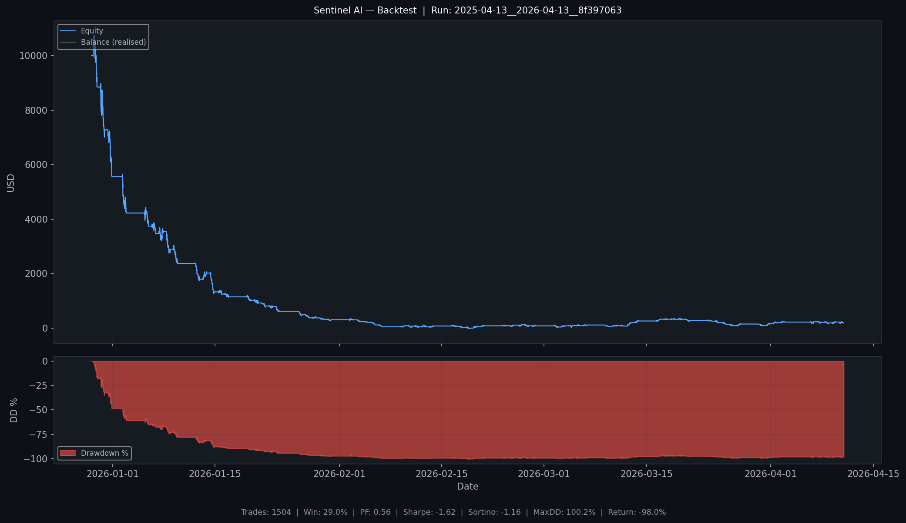

# BASELINE Backtest Report (XAUUSD, 12 Months)

Run directory: ..\backtest_results\2025-04-13__2026-04-13__8f397063

## Headline Stats
| Metric | Value |
| --- | --- |
| Total Trades | 1504.0 |
| Win Rate % | 28.99 |
| Profit Factor | 0.556 |
| Total Return % | -97.98 |
| Max Drawdown % | 100.21 |
| Sharpe Ratio | -1.625 |
| Sortino Ratio | -1.16 |
| Expectancy USD | -6.51 |
| Final Balance | 202.11 |

## Equity Curve


Sparkline:

```text
█▇▆▄▄▃▃▃▂▂▂▂▂▂▂▁▁▁▁▁▁▁▁▁▁▁▁▁▁▁▁▁▁▁▁▁▁▁▁▁▁▁▁▁▁▁▁▁▁▁▁▁▁▁▁▁▁▁▁▁
```

## Monthly Returns Heatmap (%)
| year | Jan | Feb | Mar | Apr | Dec |
| --- | --- | --- | --- | --- | --- |
| 2025.0 | nan | nan | nan | nan | nan |
| 2026.0 | -94.47 | -73.85 | 96.84 | 27.53 | nan |

## Win Rate by Session
| session_label | trades | wins | win_rate_pct |
| --- | --- | --- | --- |
| LONDON | 568 | 156 | 27.46 |
| OVERLAP | 490 | 147 | 30.0 |
| NEW_YORK | 446 | 132 | 29.6 |

## Win Rate by Day of Week
| day_of_week | trades | wins | win_rate_pct |
| --- | --- | --- | --- |
| Monday | 292 | 78 | 26.71 |
| Tuesday | 306 | 94 | 30.72 |
| Wednesday | 307 | 78 | 25.41 |
| Thursday | 306 | 98 | 32.03 |
| Friday | 293 | 87 | 29.69 |

## Win Rate by H1/H4 Bias Alignment
| bias_alignment | trades | wins | win_rate_pct |
| --- | --- | --- | --- |
| NO_CONFLUENCE | 1504 | 435 | 28.92 |

## Avg MFE vs MAE
| Metric | Value |
| --- | --- |
| Avg MFE (R) | 1.073 |
| Avg MAE (R, adverse) | 0.902 |

## Holding-Time Distribution
| holding_bin | trades |
| --- | --- |
| <=5m | 679 |
| 5-15m | 410 |
| 15-30m | 213 |
| 30-60m | 148 |
| 60-120m | 44 |
| >120m | 10 |

## Wins/Losses by Exit Stage
| stage_at_close | trades | wins | losses |
| --- | --- | --- | --- |
| BREAKEVEN | 275 | 6 | 269 |
| ENTRY | 798 | 0 | 798 |
| PARTIAL_CLOSED | 127 | 126 | 1 |
| TRAILING | 304 | 303 | 1 |

## R-Level Outcomes by Exit Reason
| close_reason | r_bucket | trades | wins |
| --- | --- | --- | --- |
| FULL_EXIT | (1R, 2R] | 16 | 16 |
| FULL_EXIT | > 2R | 97 | 97 |
| SL | <= -1R | 798 | 0 |
| TRAIL_SL | (-1R, 0R] | 263 | 0 |
| TRAIL_SL | (0R, 1R] | 68 | 68 |
| TRAIL_SL | (1R, 2R] | 140 | 140 |
| TRAIL_SL | <= -1R | 8 | 0 |
| TRAIL_SL | > 2R | 114 | 114 |
